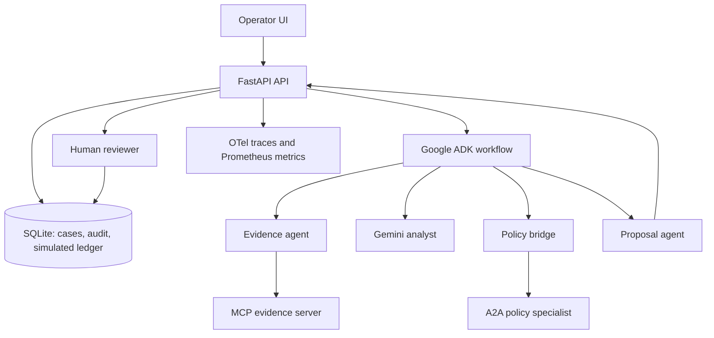

# Settlement Sentinel

**A governed, synthetic settlement-investigation system built with Google ADK, Gemini, MCP, A2A, FastAPI, human approval, and OpenTelemetry.**

Settlement Sentinel investigates a mismatch between expected and processor-settled amounts, assembles evidence, asks a separately deployed policy specialist for its rules through A2A, and produces a bounded **simulated** adjustment proposal. A reviewer must approve or reject it. The application never connects to a payment provider and never moves funds.

The repository is ready to productionize: its agent boundaries, approval contract, persistence boundary, metrics and deployment model are explicit. The [production gates](#production-gates) must be completed before handling real payment data or actions.

## Why this project matters

It demonstrates the parts of an agentic system that are often omitted from simple demos:

| Capability | Implementation |
| --- | --- |
| Google ADK | `SequentialAgent` orchestrates the evidence, analysis, policy and proposal stages. |
| Gemini | Optional `gemini_analyst` runs through the Google AI Developer API; demo mode uses no model calls. |
| MCP | A stdio MCP server exposes narrowly scoped, read-only synthetic evidence and a runbook. |
| A2A | The policy specialist is exposed with ADK `to_a2a()` and consumed with `RemoteA2aAgent`. |
| Multi-agent workflow | Evidence → analyst → remote policy → proposal, with a persisted timeline. |
| FastAPI | Typed, role-separated APIs and a lightweight operator UI. |
| Human approval | Expiring, versioned decision with a single atomic simulated-ledger write. |
| Observability | OpenTelemetry spans, correlation trace IDs, Prometheus metrics, and immutable audit events. |

## Architecture



### Workflow and safety boundary

1. The **evidence agent** calls only read-only MCP tools and retrieves synthetic settlement records.
2. The **analyst** explains the mismatch. In Gemini mode it can retrieve only the read-only runbook.
3. The **policy bridge** calls a separately hosted ADK agent through A2A. It validates that the returned policy requires a human and permits simulation only.
4. The **proposal agent** calculates an adjustment and applies the policy ceiling.
5. FastAPI persists an `awaiting_approval` case. Only the reviewer credential can approve or reject it.
6. Approval uses a database transaction and optimistic `version` check. A stale request or second submission cannot create a second ledger entry.

The model cannot access database mutation tools, reviewer credentials, real payment APIs, or an execution endpoint.

## Quick start

### 1. Create the environment

```bash
uv sync --extra dev
cp .env.example .env
```

The default `.env.example` uses `MODEL_MODE=demo`: it runs MCP and A2A locally and has **zero Gemini API calls**.

### 2. Run both services

```bash
set -a; source .env; set +a
PYTHON=.venv/bin/python ./scripts/run-local.sh
```

Open [http://127.0.0.1:8000](http://127.0.0.1:8000). The demo UI initially uses the sample tokens from `.env.example`.

### 3. Run tests

```bash
.venv/bin/python -m pytest
```

The integration test starts an A2A policy process and verifies a real local chain: MCP evidence retrieval, Google ADK orchestration, and A2A policy exchange.

## Gemini mode on the free tier

Create a Google AI Studio API key, then set these variables before running:

```bash
MODEL_MODE=gemini
GOOGLE_API_KEY=your_key
GEMINI_MODEL=gemini-2.5-flash
```

The code caps an investigation at four LLM calls and uses the free Developer API tier when the chosen model and account quota allow it. Check the current [Gemini API pricing](https://ai.google.dev/gemini-api/docs/pricing) and [rate limits](https://ai.google.dev/gemini-api/docs/rate-limits) before a demo; free-tier availability and limits can change.

## API contract

All `/api` and `/metrics` routes use a bearer credential.

| Route | Role | Purpose |
| --- | --- | --- |
| `POST /api/cases` | Operator | Start a synthetic investigation. |
| `GET /api/cases` | Operator | List the recent cases. |
| `GET /api/cases/{id}` | Operator | Retrieve a case, audit trail, timeline and trace ID. |
| `POST /api/cases/{id}/decision` | Reviewer | Approve or reject a matching case version. |
| `GET /metrics` | Operator | Prometheus metrics. |
| `GET /health` | Public | Liveness and active model mode. |

Use separate operator and reviewer credentials. The application refuses to start in `APP_ENV=production` if its configured tokens are defaults or identical.

## Observability

- `investigation`, `mcp.get_settlement`, `a2a.policy_specialist`, and `human_decision` are OpenTelemetry spans.
- Each finished case exposes its `trace_id` and event timeline in the UI and API.
- `/metrics` publishes `sentinel_runs_total`, `sentinel_run_seconds`, and `sentinel_decisions_total`.
- Set `OTEL_CONSOLE=1` locally to emit spans to stdout. In production, configure an authenticated OTLP exporter and include deployment, tenant, and correlation attributes.

## Production deployment shape

Deploy two separate Cloud Run services in the same region:

- `sentinel-policy`: the A2A policy specialist.
- `sentinel-api`: FastAPI, the UI, and API routes. Configure `A2A_URL` with the policy service’s authenticated internal URL.

Cloud Run has an always-free allowance under its current pricing model, but Cloud billing must be enabled and usage above the allowance is billable. Review the current [Cloud Run pricing](https://cloud.google.com/run/pricing) and [Google Cloud Free Tier](https://cloud.google.com/free) before deployment.

## Production gates

- Replace demo bearer tokens with workload identity/OIDC and RBAC; protect the UI, metrics and A2A endpoint.
- Replace SQLite with Cloud SQL/PostgreSQL, use migrations, and make audit records append-only with retention controls.
- Use Secret Manager for all credentials; rotate them and prevent them from reaching logs, traces and prompts.
- Deploy the two services with private networking, authenticated A2A, timeouts, retries, rate limits and egress controls.
- Export traces and metrics through authenticated OTLP/managed monitoring; set alerts for failed runs, policy errors, approval latency and token spend.
- Add a real policy source with versioning, signed releases, tests, change approval and a strict policy-decision schema.
- Add an idempotency key and outbox/inbox workflow before any real provider integration. Keep a separate privileged execution service that revalidates canonical intent at execution time.
- Add encryption, tenant isolation, PII redaction, retention/deletion controls, threat modelling, load tests, SLOs, backup/restore drills and incident runbooks.
- Evaluate Gemini prompts/tool use with fixture cases, adversarial prompt-injection cases, policy-conformance tests and cost limits.

## Project layout

```text
sentinel/
  api.py             FastAPI routes and authorization boundary
  workflow.py        Google ADK multi-agent workflow
  mcp_server.py      Read-only MCP evidence server
  policy_agent.py    Remote A2A policy specialist
  store.py           Transactional approvals, audit and simulation ledger
  telemetry.py       OpenTelemetry and Prometheus setup
  static/            Operator UI
tests/               API, approval and live A2A/MCP integration tests
```

## Explicit non-goals

This is a learning PoC and portfolio project. Its records are synthetic, the ledger is simulated, and it must not be connected to bank, card, wallet, or payment-provider systems without completing the production gates.

## References

- [Google ADK A2A quickstart](https://adk.dev/a2a/quickstart-exposing/)
- [Google ADK MCP tools](https://adk.dev/tools-custom/mcp-tools/)
- [Agent2Agent protocol](https://a2a-protocol.org/)
- [Model Context Protocol](https://modelcontextprotocol.io/)
